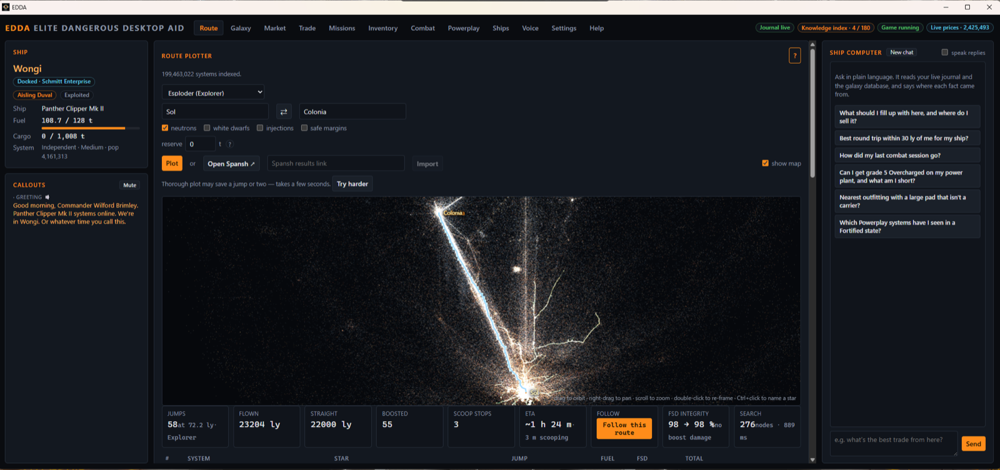

# EDDA — Elite Dangerous Desktop Aid

EDDA is a free, open-source companion for Elite Dangerous: a desktop app
that reads your journal and speaks what matters (arrivals, valuable
scans, fuel, interdictions, docking), plots routes across the whole
galaxy, finds profitable trade loops for the ship you are actually
flying, and searches for mining spots — backed by a community server
that ingests the live EDDN feed and the Spansh dumps so the app installs
small and never has to sync a galaxy. No subscription, no license key, no
account. It is a fan project, not affiliated with Frontier Developments.



## Download

Installers for Windows and Linux are at <https://edda-app.com>. The app
updates itself from the same place.

## Features

- **Route planner** — galaxy-spanning plots (bubble to Colonia and beyond)
  against a 200M-system routing index, with fuel-aware jumps and a 3D map.
- **Voice callouts** — from the journal alone, no model in the loop:
  arrival with faction states and Powerplay control, valuable scans, kills
  with the bounty, material drops, interdictions, hull and shields, fuel
  low, unscoopable star ahead, docking pad, sales and merits. A
  click-through HUD overlay shows the same feed in game.
- **Trade finder** — best single legs, round trips and rings from where
  you are, ranked by credits per hour, for any ship in your fleet.
- **Mining search** — where to mine what, near you.
- **Browser planner** — the route planner also runs in a browser at
  <https://edda-app.com/route/>, no install needed.

## Building the app

Prerequisites: Rust stable, Node.js 20+, the Tauri 2 CLI
(`cargo install tauri-cli --locked`) and Tauri's per-OS system
dependencies:

- **Windows** — WebView2 runtime (ships with Windows 10/11).
- **Linux** — see [docs/BUILDING-LINUX.md](docs/BUILDING-LINUX.md) for
  the package list (webkit2gtk, ALSA, appindicator, ...) and the notes on
  Proton journals, the HUD under Wayland and the `uinput` keyboard. What
  a *user* needs at runtime is at <https://edda-app.com/linux/>.
- **macOS** — `xcode-select --install`. The game does not run on macOS;
  this is a developer loop only.

```sh
cd frontend && npm ci && cd ..
cd src-tauri
cargo tauri dev      # dev build, opens the main window and the HUD
cargo tauri build    # installers under target/release/bundle
```

`cargo tauri` runs the frontend's `npm run dev` / `npm run build` for you
(see `src-tauri/tauri.conf.json`). A release build signs its updater
artifacts, which needs `TAURI_SIGNING_PRIVATE_KEY` in the environment;
see "Self-hosting and forks" below.

## Building and running the server

The server (`crates/ed-api`) owns a PostgreSQL store, ingests EDDN
continuously, hydrates Spansh dumps nightly, builds the routing index and
serves the app, the browser planner and app updates. The repo root has a
`compose.yaml` (PostgreSQL 16) and an `.env.example` with the variables it
reads:

```sh
docker compose up -d postgres
cp .env.example .env && set -a && . ./.env && set +a
cargo build --release -p ed-api
target/release/ed-api hydrate crates/ed-api/fixtures/synthetic-galaxy.json
target/release/ed-api serve
```

[crates/ed-api/README.md](crates/ed-api/README.md) has the whole
sequence, the Spansh hydration options, the routing product build and the
endpoint contracts. [deploy/README.md](deploy/README.md) is the production
deploy kit (systemd units, timers, Caddy, monitoring).

## Tests

```sh
cargo test --workspace            # every crate; the app's callout rules included
cd frontend && npx vitest run     # frontend
```

The server's PostgreSQL round trips are `#[ignore]` and run only when
`EDDA_API_TEST_DATABASE_URL` points at a database they may truncate
(a Docker PostgreSQL 16 works; see the ed-api README). CI runs the Linux
tests, clippy and the frontend build on every pull request into `main`;
releases are `vX.Y.Z` tags.

## Repository layout

```
crates/ed-api/          server: PostgreSQL store, EDDN ingest, hydration, HTTP API
crates/ed-galaxy/       routing index and route planner
crates/ed-route/        trade/profit finder and the time-cost model
crates/ed-store/        SQLite journal store and the PostgreSQL write path
crates/ed-eddn/         EDDN decoder and listener
crates/ed-domain/       shared types
crates/ed-journal/      journal parsing, FDevIDs name resolution
crates/ed-engineering/  blueprint database and inventory gap diffing
crates/ed-voice/        text-to-speech engines
crates/ed-input/        key injection for in-game automation
crates/ed-listen/       speech input
crates/ed-sync/         client sync against the community API
crates/ed-ebex/         the immutable artifact format the server publishes
src-tauri/              the desktop app: commands, journal watcher, callouts, HUD
frontend/               Svelte 5 + Vite: main window and HUD overlay
site/                   edda-app.com: static site, browser route planner, privacy page
deploy/                 server deploy kit
docs/                   architecture, roadmap, benches, build notes
tools/                  fixture generators, bench scripts, verification
```

## Data sources and attribution

- **Spansh** (<https://spansh.co.uk>) — the galaxy dumps the server
  hydrates from. The star clouds bundled with the app and the site, and
  the populated-bubble index, are derived from a Spansh galaxy dump.
- **EDSM** (<https://www.edsm.net>) — system and body lookups the server
  proxies. Please link back to EDSM when you show its data.
- **EDDN / EDCD** (<https://github.com/EDCD/EDDN>) — the live feed of
  market, outfitting, shipyard and journal observations.
- **FDevIDs** (<https://github.com/EDCD/FDevIDs>) — commodity and material
  tables maintained by the Elite Dangerous Community Developers.
- **EDDI** (<https://github.com/EDCD/EDDI>, Apache-2.0) — two source files
  are ported (phonetic system names, Status.json flag tables).
- **three.js** (MIT) — the 3D map on the site.

Full notices are in [docs/THIRD-PARTY.md](docs/THIRD-PARTY.md).

## Privacy

EDDA is not a surveillance tool. Nothing it collects, aggregates or
displays may identify a commander or reveal where any individual is or has
been. Feedback is anonymous by wire contract; telemetry is a closed
allowlist (warn/error callsites, timings, opt-in flags — never rendered
messages, positions or journal content); the activity heatmap is
deliberately low-resolution and nameless. The test: one EDDA user can
never work out where another EDDA user is or was. A feature that needs
individual-level data changes shape or does not ship. See
[site/privacy/](site/privacy/index.html) and the rule in
[CLAUDE.md](CLAUDE.md).

## Self-hosting and forks

The app is built to talk to `https://api.edda-app.com`. To run your own:

- **Community API** — change `DEFAULT_COMMUNITY_API` in
  `src-tauri/src/exchange.rs` (users can also override it in Settings).
- **Updater** — generate your own minisign keypair
  (`cargo tauri signer generate`), put the public key and your
  `latest.json` endpoint in `src-tauri/tauri.conf.json` (`plugins.updater`),
  and sign builds with the private key. Do not ship builds against this
  project's key and endpoint: they would try to update to our releases.
- **Bundle identifier** — change `identifier` in `tauri.conf.json` so your
  build does not collide with an installed EDDA.
- **Frontier CAPI** — the companion-API link is only usable when
  `EDDA_CAPI_CLIENT_ID` is set at build time; register your own client
  with Frontier.

## Contributing

See [CONTRIBUTING.md](CONTRIBUTING.md): build and test, the pull-request
model, the measurement doctrine and the house rules.

## Security

See [SECURITY.md](SECURITY.md) for how to report a vulnerability.

## License

MIT — see [LICENSE](LICENSE). Third-party material keeps its own license,
listed in [docs/THIRD-PARTY.md](docs/THIRD-PARTY.md).

EDDA is an unofficial fan-made companion and is not affiliated with or
endorsed by Frontier Developments. Elite Dangerous and related names and
assets remain the property of their respective owners.
